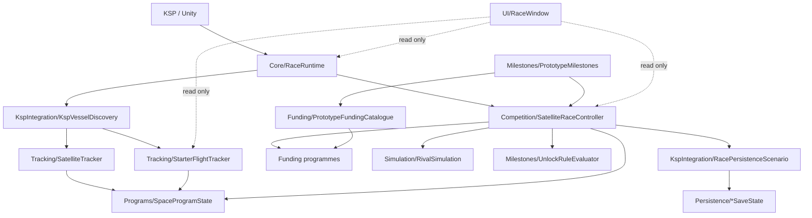

# The Race for Space - Code Reference

> **Scope:** this reference documents the implementation on `Alpha/KerbalContracts-v0.5`.
> The `main` branch is currently the repository scaffold and does not contain this implementation.
>
> **Purpose:** explain where each part of the mod lives, what every production source file owns, what its classes and important methods do, how the files interact, and where the regression coverage lives.

This document is intended for maintainers. It complements `docs/STRUCTURE.md`: `STRUCTURE.md` describes the intended module boundaries, while this file describes the concrete implementation inside those boundaries.

---

## 1. Architecture at a glance

The project deliberately separates KSP/Unity-facing code from race rules that can be tested without KSP.

### Main ownership rules

| Concern | Owner | Notes |
| --- | --- | --- |
| Lifetime and update cadence | `Core/RaceRuntime.cs` | Creates/retains one controller and starter tracker per KSP `Game`. |
| Campaign orchestration | `Competition/SatelliteRaceController.cs` | Orders restore, funding, rival simulation, unlock review, offer review, caches and save capture. |
| Milestone definitions | `Milestones/PrototypeMilestones.cs` | Code-owned milestone catalogue and starter-contract criteria. |
| Unlock semantics | `Milestones/UnlockRuleDefinition.cs`, `UnlockRuleEvaluator.cs` | Reusable OR-of-AND rule model and evaluator. |
| Program state | `Programs/SpaceProgramState.cs` | Generic achievement timestamps, satellite counts and rival mission state. |
| Player orbital vessel observation | `KspIntegration/KspVesselDiscovery.cs` + `Tracking/SatelliteTracker.cs` | KSP adapter creates snapshots; tracker applies pure race rules. |
| Starter-flight observation | `KspIntegration/KspVesselDiscovery.cs` + `Tracking/StarterFlightTracker.cs` | Frequent, telemetry-plan-driven active-vessel path. |
| Rival behaviour | `Simulation/RivalSimulation.cs` | Target choice, development progress, spending, completion and ETA. |
| Funding definitions | `Funding/PrototypeFundingCatalogue.cs` | Builds achievement and satellite funding state from milestone/config data. |
| Funding maths | `Funding/AchievementFundingProgramme.cs`, `Funding/FundingProgramme.cs` | Payout state and calculation only; controller owns timing. |
| Save integration | `KspIntegration/RacePersistenceScenario.cs` | KSP `ScenarioModule` boundary. |
| Save serialization | `Persistence/*SaveState.cs` | Converts project state to/from `ConfigNode`. |
| User interface | `UI/RaceWindow.cs` | Presentation only; never advances campaign state. |
| Balance configuration | `Core/RaceSettings.cs`, `KspIntegration/RaceSettingsLoader.cs`, `GameData/.../RaceSettings.cfg` | Defaults plus user-editable four-tier balance configuration. |

---

## 2. Runtime flow and timing

`RaceRuntime` is loaded in every saved-game scene. It keeps one `SatelliteRaceController` and one `StarterFlightTracker` alive across normal scene changes for the current `Game` object.

The recurring work is intentionally split by cost:

- **Every 1 second:** observe only the active vessel for offered unfinished starter contracts. The telemetry bit mask means KSP calls such as total mass, biome lookup or crash callbacks are only used when an active contract needs them.
- **Every 5 seconds:** run the normal controller refresh: restore if needed, process funding/rivals/unlocks/offers, rebuild payout caches, and capture persistent state.
- **Every 20 seconds:** include a full saved-vessel scan so player satellite counts and orbital milestones are refreshed without walking every `ProtoVessel` every 5 seconds.
- **At every crossed funding boundary:** replay the exact funding timestamp in order. Rivals advance to that boundary first, existing offers pay, achievement interest advances, sponsor review fills vacancies, then the next boundary is scheduled.

The UI is not part of this progression loop. `RaceWindow` reads the controller and starter tracker only.

---

# 3. Production source reference

## 3.1 `Competition/SatelliteRaceController.cs`

### Purpose

The central campaign coordinator. It owns the collection of agencies and funding-contract state for one campaign and defines the **order** in which otherwise independent systems run. It does not own the code-defined catalogue, KSP vessel APIs, the raw payout formulas, or the rival mission rules.

### Primary class: `SatelliteRaceController`

Important state includes:

- `PlayerProgram` plus `_rivalPrograms` and the combined `_programs` collection.
- Achievement and satellite funding programme collections created by `PrototypeFundingCatalogue`.
- `_activeStarterContracts`, a cached read-only list used by the 1-second starter tracker.
- Two 2D payout caches so repeated IMGUI queries do not recalculate cross-agency shares.
- `_nextFundingUniversalTime` and the configured funding interval.
- Restore/cache dirty flags.

### Function map

| Function/property | Responsibility |
| --- | --- |
| `SatelliteRaceController()` | Creates player/rivals, loads fresh programme state from the catalogue, sets configured rival starting funds, allocates payout caches and exposes read-only collection views. First two rival IDs are `aster` and `cobalt`; extra configured rivals receive stable `rival-N` IDs. |
| `ActiveStarterContracts` | Internal cached list of offered, unexpired starter contracts the player has not completed. |
| `NotifyPlayerStarterAchievementRecorded()` | Marks the active starter plan dirty after the 1-second tracker records an achievement. |
| `FindProgramById(string)` | Stable-ID lookup across player and rivals. |
| `DaysUntilNextFunding` | Converts the next funding boundary to whole Kerbin days remaining. |
| `GetKerbinYear(double)` / `GetKerbinDay(double)` | Formats universal time using 21,600-second Kerbin days and 426-day years. |
| `GetRivalLaunchProgressCost(...)` | Delegates the current rival mission-step cost to `RivalSimulation`. |
| `GetEstimatedRivalLaunchDays(...)` | Delegates rival ETA projection using the real next funding boundary and interval. |
| `HasProgramAchieved(...)` | Convenience check using programme ID as the milestone ID. |
| `IsAchievementProgrammeAvailable(...)` | Evaluates the programme unlock rule at current campaign time; availability is deliberately separate from sponsor offer state. |
| `GetAchievementAgencyCount(...)` | Returns how many agencies have ever recorded the achievement. |
| `GetSatelliteCurrentPayout(...)` | Returns cached projected satellite payout after a refresh, with direct calculation as pre-cache fallback. |
| `GetAchievementCurrentPayout(...)` | Returns cached projected next achievement payout, again with a direct fallback. |
| `Refresh()` | Public full refresh; calls `Refresh(true)`. |
| `Refresh(bool refreshPlayerVessels)` | Main orchestration method. Restores persisted campaign state once, initializes funding boundary, processes overdue funding, optionally scans player vessels, updates availability, runs rivals, updates special offers/fulfilment/start state, rebuilds starter plan and payout caches, then captures persistence. Returns whether a full player-vessel observation succeeded. |
| `RefreshRivals(double)` | Thin boundary around `RivalSimulation.Refresh`. |
| `UpdateFundingAvailability(double)` | Permanently unlocks satellite programmes whose structured unlock rules are satisfied. |
| `UpdateSpecialAchievementOffers(double)` | Gives **Probe Orbit** its immediate offer once any Level V starter path unlocks it. Normal starter progression still waits for sponsor review. |
| `UpdateSatelliteTargetReachedState()` | Permanently marks a satellite contract fulfilled once collective qualifying satellites meet its target. |
| `StartAchievementContracts(double)` | Starts an offered achievement funding lifecycle when at least one agency has achieved it by the evaluation time. |
| `ProcessDueFunding(double)` | Replays every crossed global funding boundary. Pays satellite funding and rival base income, then achievement payments, expires completed achievement contracts, runs sponsor review, and advances the boundary. |
| `ReviewFundingOffers(double)` | Sponsor selection. Offers all unlocked starter contracts independently; fills at most two unfinished normal achievement offers and at most two unfulfilled satellite offers. |
| `RebuildActiveStarterContractPlanIfNeeded()` | Rebuilds and replaces the read-only starter list only after a relevant offer/completion/expiry transition. This stable list identity is used by `RaceRuntime` to cache telemetry requirements. |
| `AwardProgramFunds(...)` | Player payouts go through `CareerFundingAdapter`; rival payouts increase simulated `Funds`. |
| `EvaluateFundingProgrammes()` | Rebuilds both payout caches and each program's `NextPayoutFunds`, including rival base income and next-boundary achievement shares. |
| `CalculateSatelliteFundingForProgram(...)` | Sums live satellite funding across all offered available satellite programmes for one agency. |
| `CalculateSatelliteCurrentPayout(...)` | Calculates one agency/programme share using collective satellite count and `FundingProgramme.CalculateCurrentPayout`. |
| `GetCollectiveSatelliteCount(string)` | Sums body-specific satellite counts across all agencies. |
| `CalculateAchievementCurrentPayout(...)` | Direct calculation of one agency's share at the next funding boundary. |
| `IsAchievementProgrammeAvailableAtTime(...)` | Shared historical-time unlock evaluation helper. |
| `GetAchievementAgencyCountAtTime(...)` | Counts agencies whose first achievement time is at or before the supplied boundary. |
| `HasProgramAchievedByTime(...)` | Historical eligibility helper used to prevent retroactive funding. |

### Important ordering invariant

A vessel observation that happens on/after a funding boundary is **not** allowed to receive that boundary's payout retroactively. Due funding is processed before the newer player-vessel observation is applied.

---

## 3.2 `Core/RaceRuntime.cs`

### Purpose

KSP `MonoBehaviour` that owns controller/tracker lifetime and schedules campaign work independently from the UI.

### Primary class: `RaceRuntime`

| Function/property | Responsibility |
| --- | --- |
| `Controller` | Returns the current controller only when the active saved game matches the controller's owner. |
| `StarterFlightState` | Read-only access for UI presentation; UI must not call tracker progression methods. |
| `Awake()` | Rejects loading/menu scenes, prevents duplicate `EveryScene` instances and initializes state for the current game. |
| `OnDestroy()` | Clears static active-instance ownership. |
| `Update()` | Runs 5-second controller refreshes, 20-second full vessel discovery, one-time starter-progress restoration and 1-second active-vessel starter evaluation. |
| `RefreshStarterFlightState()` | Reuses the controller's active starter plan, updates the telemetry mask when plan identity changes, consumes a pending impact before sampling a replacement craft, feeds snapshots to `StarterFlightTracker`, triggers immediate non-vessel controller settling after an achievement, and captures temporary progress. |
| `EnsureControllerForCurrentGame()` | Loads settings before controller construction, creates fresh controller/tracker for a new save and resets KSP callback/cadence state. |

The duplicate-instance checks are important because KSP can briefly instantiate multiple `EveryScene` addons during transitions.

---

## 3.3 `Core/RaceSettings.cs`

### Purpose

Holds built-in balance defaults and the runtime values loaded from `RaceSettings.cfg`.

### `RaceBodySettings`

One mutable balance tier containing probe/crewed rival progress cost, probe/crewed achievement reward, satellite progress cost, network size and network value.

### `RaceSettings`

| Function | Responsibility |
| --- | --- |
| static constructor | Calls `ResetToDefaults()` before any loader changes are applied. |
| `ResetToDefaults()` | Restores the four built-in tiers and global funding/rival defaults. |
| `GetBodySettings(string)` | Maps a body name to one of the four tiers. Kerbin, Kerbin moons, selected stock planetary moons and the default interplanetary-planet tier are currently hardcoded here. Unknown bodies deliberately fall back to the more expensive interplanetary-planet tier. |

This is one of the current hardcoding points to revisit if body definitions become data-driven.

---

## 3.4 `Funding/AchievementFundingProgramme.cs`

### Purpose

Mutable lifecycle state for one competitive achievement funding contract. The definition is code-owned; the instance records offer/start/payment state for one campaign.

### `AchievementFundingProgramme`

| Member | Responsibility |
| --- | --- |
| Constructors | Store stable ID, display/objective text, base reward and optional structured unlock rule. Negative base rewards are clamped to zero. |
| `IsExpired` | True after 10 processed payments. |
| `CurrentInterestPercent` | 100%, 90%, ... 10%, then 0% after expiry. |
| `CurrentTotalPayoutFunds` | Base reward multiplied by current interest. |
| `Offer()` | One-way gameplay transition into sponsor-offered state unless already expired. |
| `Start()` | Starts the lifecycle after the first agency achieves the objective. Does not pay immediately. |
| `CalculateCurrentPayout(bool,int)` | Splits the current total payout equally among agencies eligible at that exact funding boundary. |
| `AdvancePayout()` | Advances one step through the ten-payment lifecycle. |
| `RestoreState(...)` | Restores persisted start/payment state with clamping and normalization. |
| `RestoreOfferState(bool)` | Persistence-only replacement of offer state when another save is loaded. |

---

## 3.5 `Funding/FundingProgramme.cs`

### Purpose

Mutable lifecycle state and payout formula for one permanent satellite-network funding target.

### `FundingProgramme`

| Member | Responsibility |
| --- | --- |
| Constructors | Store stable ID, body, network target/value, availability text and optional structured unlock rule. |
| `Unlock()` | Permanently marks the target available in the current campaign. |
| `Offer()` | Permanently marks it sponsor-offered. |
| `MarkSatelliteTargetReached()` | Remembers that the collective network target was reached at least once; used by sponsor vacancy logic. |
| `RestoreAvailability(...)` | Persistence-only state replacement. |
| `RestoreOfferState(...)` | Persistence-only replacement of offered/fulfilled state. |
| `CalculateCurrentPayout(programCount,totalCount)` | Before network saturation: pays by completion percentage of the fixed pool. After saturation: distributes the same fixed pool by ownership share. Defensive normalization prevents an impossible caller total from producing more than 100% ownership. |

---

## 3.6 `Funding/PrototypeFundingCatalogue.cs`

### Purpose

Builds the fresh funding programme set for a new controller. Catalogue membership belongs here rather than in the controller.

### Key functions

| Function | Responsibility |
| --- | --- |
| `CreateAchievementProgrammes()` | Creates one achievement funding programme for every starter milestone and every orbital milestone. |
| `CreateSatelliteProgrammes()` | Creates network programmes for Kerbin, Mun, Minmus, Duna, Moho, Eve, Gilly, Ike, Dres, Jool, Laythe, Vall, Tylo, Bop, Pol and Eeloo. |
| `AddAchievementProgramme(...)` | Uses explicit starter rewards for starter contracts; ordinary milestones take crewed/probe reward from their body's balance tier. Level I starter contracts are initial offers. |
| `CreateSatelliteProgramme(...)` | Uses the target body's tier for network size/value and starts the target locked. |
| `CreateKerbinMoonNetworkUnlockRule(...)` | Requires the target probe achievement plus 60% of the Kerbin network. |
| `CreateInterplanetaryPlanetNetworkUnlockRule(...)` | Requires the target probe achievement plus 60% of both Mun and Minmus networks. |
| `CreatePlanetaryMoonNetworkUnlockRule(...)` | Requires the moon probe achievement plus 60% of its parent planet's network. |
| `CreateNetworkProgressCondition(...)` | Converts 60% of configured network size to a minimum whole qualifying-satellite count using `Ceiling`. |
| `CreateUnlockRequirementText(...)` | Derives player-facing requirement text from the structured rule and fails fast on rule shapes it cannot describe. |
| `IsSingleAgencyAchievementCondition(...)` | Validation helper for text generation. |
| `FindRequiredMilestone(...)` | Stable-ID lookup that throws if catalogue wiring refers to a missing milestone. |

This file is the second major body-content hardcoding point.

---

## 3.7 `KspIntegration/CareerFundingAdapter.cs`

### Purpose

Keeps direct KSP Career economy calls out of controller/domain logic.

### Function

`TryAddFunds(double amount)` validates a finite positive payout, verifies the game is Career and KSP's global `Funding.Instance` exists, then awards funds using `TransactionReasons.ContractReward`.

---

## 3.8 `KspIntegration/KspCelestialBodyOrdering.cs`

### Purpose

Provides stable UI ordering from Kerbin outward without using moving live planetary positions.

### Function map

| Function | Responsibility |
| --- | --- |
| `GetSortDistanceFromKerbin(string)` | Finds home/target bodies, walks each parent chain, finds the common ancestor and combines mean orbital-radius distances. Invalid/unresolvable bodies sort at the end using `double.MaxValue`. |
| `CreatePathToRoot(CelestialBody)` | Builds a parent path and detects malformed cyclic body graphs. |
| `SumOrbitRadii(...)` | Adds finite orbit radii along part of a path. |
| `FindBody(string)` | Case-insensitive lookup in `FlightGlobals.Bodies`. |
| `GetOrbitRadius(CelestialBody)` | Returns absolute semi-major axis or the invalid sentinel. |
| `GetParent(CelestialBody)` | Safely returns `referenceBody` when a real parent exists. |

The ordering helper itself can handle bodies beyond the current stock catalogue as long as KSP supplies a valid body graph.

---

## 3.9 `KspIntegration/KspVesselDiscovery.cs`

### Purpose

The main KSP vessel adapter. Converts live/persistent KSP objects into project-owned snapshots and owns the KSP-specific destruction callbacks needed for Directed Power impact detection.

### Function map

| Function | Responsibility |
| --- | --- |
| `TryCaptureOrbitingVessels(...)` | Scans saved `ProtoVessel`s, preferring live vessel state when loaded, and returns normalized orbiting-vessel snapshots plus one stable observation UT. Loaded and unloaded vessels therefore share one tracker path. |
| `TryCaptureActiveVessel(StarterTelemetryRequirement,...)` | Captures only the controlled loaded non-EVA vessel. Expensive/condition-specific fields are read only when requested by the telemetry mask. Validates transient numeric data before creating `ActiveVesselTrackingSnapshot`. |
| `TryConsumeActiveVesselSurfaceImpact(...)` | Returns and clears one pending normalized surface-impact event. |
| `DisableActiveVesselSurfaceImpactTracking()` | Removes per-vessel and global destruction callbacks and clears all cached impact evidence when no active contract needs it. |
| `ResetActiveVesselTracking()` | Clears callbacks/evidence and save ownership when the active KSP game changes. |
| `EnsureActiveTrackingGame()` | Detects a new `Game` and resets callback state. |
| `EnsureVesselWillDestroySubscription()` | Subscribes to KSP's global destruction event only while Directed Power needs impact data. |
| `TrackActiveVesselDestruction(Vessel)` | Hooks the active vessel's `OnJustAboutToBeDestroyed` event; switches safely when active vessel/stage changes. |
| `DetachDestructionCallback()` | Removes the per-vessel callback. |
| `CaptureDestructionTelemetry(...)` | Stores the most recent genuine Flying/SubOrbital clearance, speed and UT, preserving it if KSP briefly reports Landed/Splashed during breakup. |
| `OnVesselWillDestroy(Vessel)` | Global-event adapter into normalized impact handling. |
| `RecordPotentialSurfaceImpact(Vessel)` | Validates vessel identity, obtains current clearance/time and delegates the actual heuristic to `SurfaceImpactEvaluator`; stores a pending impact if eligible. |
| `GetSurfaceClearanceMeters(Vessel)` | Uses the best available minimum of terrain height and altitude; positive infinity means unavailable. |
| `ConvertSituation(...)` | Maps KSP situations to `TrackedFlightSituation`. |
| `ConvertVesselType(...)` | Maps Probe/Relay to project vessel types; everything else becomes `Other`. |
| `GetProtoCrewCount(...)` | Counts crew in persistent part snapshots for unloaded craft. |
| `IsFinite(double)` | Numeric validation helper. |

KSP APIs should remain in this module rather than leaking into `Tracking`.

---

## 3.10 `KspIntegration/RacePersistenceScenario.cs`

### Purpose

KSP `ScenarioModule` boundary that stores Race for Space state inside the active save.

### Save sections

- `FUNDING_CONTRACTS` -> `FundingContractsSaveState`
- `RIVALS` -> `RivalProgramsSaveState`
- `ACTIVE_CONTRACT_PROGRESS` -> `ActiveContractProgressSaveState`
- root `commandCenterVisible` -> UI visibility

### Function map

| Function | Responsibility |
| --- | --- |
| `OnLoad(ConfigNode)` | Deserializes only when a different KSP `Game` becomes current; ordinary scene changes retain newer in-memory state. |
| `OnSave(ConfigNode)` | Writes current state only when the scenario is ready and belongs to the current game. |
| `TryRestoreCommandCenterVisibility(...)` / `CaptureCommandCenterVisibility(...)` | Persist the open/closed command-center state. |
| `TryRestoreRivalState(...)` | Applies saved rival state by stable program ID. |
| `TryRestoreRaceProgress(...)` | Restores player achievement history, all funding lifecycle state and next global funding boundary. |
| `TryRestoreActiveContractProgress(...)` | Restores temporary starter-flight and Control hold state. |
| `CaptureRivalState(...)` | Captures all simulated rivals. |
| `CaptureRaceProgress(...)` | Captures player/funding state and next funding time. |
| `CaptureActiveContractProgress(...)` | Captures the current starter attempt without forcing an immediate disk write. |

---

## 3.11 `KspIntegration/RaceSettingsLoader.cs`

### Purpose

Loads `GameData/TheRaceForSpace/Config/RaceSettings.cfg` once before the first controller is constructed.

| Function | Responsibility |
| --- | --- |
| `EnsureLoaded()` | One-shot load. Resets defaults first, reads root/global values and applies all four body tiers. Missing file/node or invalid values keep defaults and log a KSP message. |
| `ApplyBodySettings(...)` | Applies one tier node to an existing `RaceBodySettings`. |
| `ReadDouble(...)` | Invariant-culture, finite, range-checked parser with fallback. |
| `ReadInt(...)` | Invariant-culture, range-checked integer parser with fallback. |
| `LogInvalidValue(...)` | Emits a warning naming the bad value and fallback. |

---

## 3.12 `Milestones/MilestoneDefinition.cs`

### Purpose

Defines the immutable data model for orbital and starter achievements. Tracking code consumes these definitions rather than hardcoding balance thresholds.

### Types

- `MilestoneCrewRequirement`: `UncrewedProbe`, `Crewed`.
- `MilestoneSituation`: currently `Orbit`.
- `MilestoneObjectiveType`: `Orbit`, `DirectedPower`, `DeliveredMass`, `AltitudeHold`, `BiomeVisit`.
- `StarterContractLine`: `None`, `DirectedPower`, `Mass`, `Control`, `Biome`.
- `StarterContractCriteria`: internal immutable criteria holder with factories `DirectedPower`, `Mass`, `Control`, `Biome`, plus `None`.
- `MilestoneVesselObservation`: KSP-independent body/situation/crew observation used by ordinary orbital evaluation.
- `MilestoneDefinition`: immutable milestone definition with stable ID, body, crew requirement, objective text, unlock rule, starter metadata, reward/progress costs and explicit measurable criteria.

### Important functions

| Function | Responsibility |
| --- | --- |
| `StarterContractCriteria.DirectedPower(...)` | Supplies required speed and altitude ceiling. |
| `StarterContractCriteria.Mass(...)` | Supplies landed mass and surface-distance requirements. |
| `StarterContractCriteria.Control(...)` | Supplies altitude band and continuous hold duration. |
| `StarterContractCriteria.Biome(...)` | Supplies target biome name. |
| `MilestoneDefinition.IsSatisfiedBy(...)` | Matches ordinary orbital observations by body, situation and crew qualification. Starter contracts deliberately use `StarterFlightTracker` instead. |
| `CreateObjectiveDescription(...)` | Generates starter contract text from the same criteria used for evaluation, preventing display thresholds from drifting away from gameplay thresholds. |

---

## 3.13 `Milestones/PrototypeMilestones.cs`

### Purpose

The code-owned milestone catalogue for the current campaign.

### Starter catalogue

There are 20 starter milestones: five levels in each of four parallel lines.

| Line | Level I -> V criteria |
| --- | --- |
| Directed Power | 600, 1,100, 1,400, 1,700, 2,000 m/s; all must stay at or below 70 km and then impact Kerbin. |
| Mass | Land with 1 t at 25 km; 2.5 t at 75 km; 5 t at 150 km; 10 t at 300 km; 20 t at 600 km from launch. |
| Control | Crewed altitude holds: 2-5 km/30 s; 8-12 km/45 s; 15-25 km/60 s; 30-40 km/75 s; 50-65 km/90 s; then land safely on Kerbin. |
| Biome | Land in Grasslands, Highlands, Mountains, Deserts, then Ice Caps without entering orbit. |

Each Level II-V rule is unlocked by any agency completing the previous level in the same line. Completing **any** Level V line provides one alternative path to unlock Probe Orbit.

### Orbital catalogue

`All` currently contains 32 probe/crewed orbital milestones covering Kerbin, Mun, Minmus, Duna, Moho, Eve, Gilly, Ike, Dres, Jool, Laythe, Vall, Tylo, Bop, Pol and Eeloo.

General progression patterns are:

- Probe Orbit: any one starter Level V.
- Crewed Kerbin Orbit: Probe Orbit.
- Mun/Minmus probe: Probe Orbit.
- Mun/Minmus crewed: Crewed Orbit.
- Interplanetary planet probes: both Mun Probe Orbit and Minmus Probe Orbit.
- Interplanetary planet crewed: both Mun Crewed Orbit and Minmus Crewed Orbit.
- Planetary moons: the matching probe/crewed parent-planet orbit.

### Function map

| Function/property | Responsibility |
| --- | --- |
| `All` | Read-only ordinary orbital definitions. |
| `StarterContracts` | Read-only 20 starter definitions. |
| `FindById(string)` | Case-insensitive stable-ID lookup across both catalogues. |
| `CreateMilestoneIndex()` | Builds the lookup dictionary and therefore also fails on duplicate IDs. |
| `CreateStarterMilestone(...)` | Applies common Kerbin/starter metadata, reward scaling and prior-level unlock wiring. |
| `CreateProbeOrbitUnlockRule()` | OR rule across the four Level V starter milestones. |
| `CreateInterplanetaryProbeUnlockRule()` | AND rule for Mun + Minmus probe milestones. |
| `CreateInterplanetaryCrewedUnlockRule()` | AND rule for Mun + Minmus crewed milestones. |

This file is the primary place to change starter thresholds or add/remove ordinary milestone definitions.

---

## 3.14 `Milestones/UnlockRuleDefinition.cs`

### Purpose

Reusable immutable model for campaign prerequisites.

### Rule model

- A `UnlockRuleDefinition` contains one or more **paths**; any path may unlock the target (**OR**).
- A `UnlockPathDefinition` contains one or more **conditions**; every condition in the path must pass (**AND**).
- A `null` rule is interpreted by consumers as available from campaign start.

### Types/functions

| Type/function | Responsibility |
| --- | --- |
| `UnlockConditionType` | Supports `Achievement`, `UniversalTime`, `SatelliteCount`. |
| `UnlockProgramScope` | Limits achievement conditions to `AnyAgency`, `Player` or `AnyRival`. |
| `UnlockConditionDefinition.Achievement(...)` | Creates a one- or multi-agency achievement condition with validation. |
| `AfterUniversalTime(double)` | Creates an exact campaign-time threshold. |
| `SatelliteCount(string,int)` | Creates a collective body-specific satellite requirement. |
| `UnlockPathDefinition(...)` | Clones its conditions and exposes them read-only. |
| `UnlockRuleDefinition(...)` | Clones its paths and exposes them read-only. |
| `AnyAgencyAchievement(string)` | Convenience constructor for the common single-achievement unlock. |

---

## 3.15 `Milestones/UnlockRuleEvaluator.cs`

### Purpose

Single KSP-independent interpretation of unlock rules. Controller, trackers and UI use this evaluator so availability and displayed progress cannot silently disagree.

| Function | Responsibility |
| --- | --- |
| `IsSatisfied(...)` | Evaluates OR paths; null rule succeeds; malformed/empty rules fail closed. |
| `IsConditionSatisfied(...)` | Evaluates one time, satellite-count or achievement condition. |
| `GetSatisfiedProgramCount(...)` | Counts agencies that satisfy an achievement condition at a historical evaluation time. |
| `GetSatelliteCount(...)` | Sums current qualifying satellites across all programs for the condition body. |
| `DoesProgramSatisfyAchievementCondition(...)` | Checks program scope and first achievement timestamp against evaluation time. |
| `IsPathSatisfied(...)` | Internal AND evaluation. |
| `ProgramMatchesScope(...)` | Applies player/rival/any-agency scope. |
| `IsValidEvaluationTime(...)` | Finite non-negative UT guard. |

---

## 3.16 `Persistence/ActiveContractProgressSaveState.cs`

### Purpose

Persists **temporary** starter-contract evidence across save/load: one active flight attempt plus independent Control hold states. It does not store funding lifecycle or player orbital vessel counts.

| Function/type | Responsibility |
| --- | --- |
| `Capture(StarterFlightTracker)` | Copies historical attempt fields and every live Control contract state. |
| `ApplyTo(StarterFlightTracker)` | Restores the common attempt then each Control state by stable milestone ID; clears the tracker if no active attempt was saved. |
| `Load(ConfigNode)` | Strictly parses the save node. Partial/malformed attempt data or duplicate/malformed Control entries invalidate the attempt rather than inventing progress. |
| `Save(ConfigNode)` | Writes the active flag, historical evidence and repeated `CONTROL_STATE` nodes. |
| `ClearState()` | Resets the internal snapshot. |
| `AddDouble(...)` | Writes round-trip (`R`) invariant-culture doubles. |
| `ParseBool(...)`, `TryParseBool(...)`, `TryParseFiniteDouble(...)` | Defensive parsing helpers. |
| `SavedControlContractProgress` | Private DTO for one Control milestone's hold/in-band/qualified state. |

---

## 3.17 `Persistence/FundingContractsSaveState.cs`

### Purpose

Persists player achievement history, all mutable achievement/satellite funding lifecycle state, and the next shared funding boundary. Definitions remain code-owned and are matched by stable ID.

| Function/type | Responsibility |
| --- | --- |
| `Capture(...)` overloads | Clears old snapshot and copies player achievement timestamps, achievement offer/start/payment state, satellite availability/offer/target state and optional next funding UT. |
| `ApplyTo(...)` | Replaces player achievements and contract lifecycle state. Configured contracts absent from the save are explicitly reset to their initial unoffered/unstarted/locked state. |
| `Load(ConfigNode)` | Parses saved dictionaries by stable ID. Malformed individual entries are skipped rather than crashing the load. |
| `Save(ConfigNode)` | Writes deterministic case-insensitive sorted IDs for stable save output. |
| `ClearState()` | Resets dictionaries and next boundary. |
| `StorePlayerAchievement(...)` | Preserves the earliest valid timestamp for duplicate achievement nodes. |
| Parsing helpers | Clamp payment counts and reject non-finite doubles. |
| `SavedAchievementContract` | Private mutable-state DTO: offered, started, payments processed. |
| `SavedSatelliteContract` | Private mutable-state DTO: available, offered, target reached. |

---

## 3.18 `Persistence/RivalProgramsSaveState.cs`

### Purpose

Persists every rival by stable program ID. Display names are not save-owned; mutable simulation state is.

### `RivalProgramsSaveState`

`Capture`, `ApplyTo`, `Load` and `Save` operate on the rival collection as a unit. Duplicate IDs in malformed save data use the last valid node.

### Nested `SavedRivalProgram`

Stores funds, stable mission target ID, launch progress/check time, arbitrary achievement timestamps and arbitrary body satellite counts.

| Function | Responsibility |
| --- | --- |
| `Capture(SpaceProgramState)` | Copies mutable non-player state. |
| `ApplyTo(SpaceProgramState)` | Replaces rival funds/collections/progress after stable-ID validation. `NextMissionDisplayName` is deliberately cleared so live catalogue data regenerates presentation text. |
| `Load(ConfigNode)` | Defensive, clamped parsing of scalar state plus repeated achievement/satellite nodes. |
| `Save(ConfigNode)` | Deterministic sorted output. |
| `StoreAchievement(...)` | Keeps earliest duplicate timestamp. |

---

## 3.19 `Programs/SpaceProgramState.cs`

### Purpose

Generic campaign state for one player or rival agency. This class is deliberately not tied to a fixed milestone field list or fixed celestial-body field list.

### `SpaceProgramState`

| Member | Responsibility |
| --- | --- |
| Constructors | Establish stable `Id`, display `Name` and player/rival identity. |
| `Funds` | Simulated spendable rival balance. The player's real funds remain KSP-owned. |
| `NextPayoutFunds` | Controller-computed projected next payout for UI/ETA. |
| `NextMissionTargetId` | Stable rival mission identity used by simulation/persistence. |
| `NextMissionDisplayName` | Derived presentation text only. |
| `LaunchProgressPercent` / `NextLaunchProgressCheckUniversalTime` | Rival mission-development state. |
| `RecordedAchievements` / `SatelliteCountsByBody` | Internal enumerable views used by persistence. |
| `ClearRecordedAchievements()` / `ClearSatelliteCounts()` | State replacement helpers. |
| `HasAchievement(string)` | Case-insensitive stable-ID membership check. |
| `GetAchievementUniversalTime(string)` | First timestamp or `-1`. |
| `RecordAchievement(string,double)` | Records the first finite observation only; later observations do not replace it because historical funding eligibility depends on that first time. |
| `GetSatelliteCount(string)` | Body-specific current count. |
| `SetSatelliteCount(string,int)` | Sets or removes a body entry; non-positive counts remove the key. |

This generic dictionary-based design is already ready for arbitrary future milestone IDs and body names even though the current catalogue is hardcoded.

---

## 3.20 `Simulation/RivalSimulation.cs`

### Purpose

KSP-independent lightweight competitor simulation.

### Behaviour constants

- Progress check every 5 Kerbin days.
- Successful ordinary/satellite step: +10%.
- Successful starter-contract step: +20%.
- When both target categories exist, 60% chance to choose a satellite mission and 40% an achievement mission.
- A progress check succeeds only if the rival can afford the step and the configured random progress chance passes.

### Function map

| Function | Responsibility |
| --- | --- |
| `Refresh(...)` | Validates inputs and advances every non-player program. |
| `GetMissionTargetDisplayName(...)` | Resolves stable target ID to achievement name or satellite body display text. |
| `CalculateLaunchProgressIncrementPercent(...)` | Returns 20% for starter targets, otherwise 10%. |
| `CalculateLaunchProgressCost(...)` | Calculates one successful development-step cost from stable target ID. |
| `CalculateEstimatedLaunchDays(...)` | Projects average completion time using progress chance, current progress/funds, scheduled next payout and recurring funding interval. Returns `null` if projected income cannot finance the remaining mission. |
| `RefreshProgram(...)` | Repairs unavailable targets, selects a target when needed, initializes the check schedule, replays crossed 5-day checks, spends on successful progress and completes/retargets missions. |
| `TryCompleteLaunch(...)` | At 100%, records an achievement or increments a satellite network. Only a real uncrewed **orbital** achievement creates persistent satellite presence; atmospheric starter contracts do not. |
| `IsTargetAvailable(...)` | Achievement targets require offered/unexpired/unachieved state; satellite targets require available + offered. |
| `ChooseNextMissionTarget(...)` | Builds live candidate lists, chooses category probabilistically and chooses a target uniformly within it. |
| `CalculateLaunchProgressCostForTarget(...)` | Starter uses explicit milestone cost; normal achievements use crew/probe body tier; satellite missions use satellite body tier; invalid IDs fall back to Kerbin probe cost. |
| `SetMissionTarget(...)` | Writes stable ID and regenerates display name. |
| `FindAchievementProgramme(...)` / `FindFundingProgramme(...)` | Collection lookup helpers. |
| `IsFinite(double)` | Numeric guard. |

---

## 3.21 `Tracking/ActiveVesselTrackingSnapshot.cs`

### Purpose

Defines the normalized high-frequency active-vessel data contract between KSP integration and starter-flight logic.

### Types

- `TrackedFlightSituation`: project-owned situation enum.
- `StarterTelemetryRequirement`: flags for Altitude, SurfaceSpeed, Mass, Biome, Crew and SurfaceImpact.
- `StarterTelemetryPlan`: derives the minimum telemetry mask from the current active starter contract set.
- `ActiveVesselTrackingSnapshot`: immutable sample containing identity, body, situation, selected telemetry, coordinates, launch UT and observation UT.

### `StarterTelemetryPlan.GetRequirements(...)`

- Directed Power -> altitude + surface speed + surface impact.
- Mass -> mass.
- Control -> altitude + crew.
- Biome -> biome.

Common identity/body/situation/launch/coordinate values are always available because they are cheap and preserve attempt continuity.

---

## 3.22 `Tracking/VesselTrackingSnapshot.cs`

### Purpose

Minimal normalized snapshot used by the slower orbital/satellite scan.

- `TrackedVesselType`: `Other`, `Probe`, `Relay`.
- `VesselTrackingSnapshot`: immutable body, normalized vessel type and crew count.

This keeps `SatelliteTracker` independent of KSP's `Vessel`, `ProtoVessel` and enum types.

---

## 3.23 `Tracking/SatelliteTracker.cs`

### Purpose

Applies normalized orbiting-vessel snapshots to the player's live satellite counts and ordinary orbital milestone state.

| Function | Responsibility |
| --- | --- |
| `RefreshPlayerSatelliteCounts(...)` | Rebuilds authoritative Probe/Relay counts by body, creates crewed/uncrewed orbital observations, replaces player satellite counts, then evaluates milestone definitions. Crewed Probe/Relay craft still count as satellites but are qualified as crewed for milestone matching. |
| `EvaluateMilestones(...)` | Repeats evaluation while a new achievement is recorded, allowing one vessel snapshot to unlock and immediately satisfy a chained milestone without depending on catalogue ordering. |

---

## 3.24 `Tracking/StarterFlightTracker.cs`

### Purpose

Stateful, KSP-independent evaluator for the four pre-orbit contract lines. Maintains one launch attempt plus independent Control state per active milestone ID.

### Attempt continuity

A snapshot is the same attempt if it has the same vessel ID, or if staging changes the ID but launch time is within 1 second and the body is unchanged. A gap over 5 seconds cannot prove a continuous Control hold, so unqualified Control progress resets.

### Function map

| Function | Responsibility |
| --- | --- |
| State getter properties | Expose historical maxima and latest live values for UI/persistence without allowing external mutation. |
| `GetControlHoldSeconds(...)` | Read current continuous hold for one Control milestone. |
| `IsControlMilestoneQualified(...)` | True after its hold is complete and it is waiting for a qualifying landing. |
| `IsControlSampleInBand(...)` | Exposes whether the previous sample was in this specific Control altitude band. |
| `RestoreControlState(...)` | Persistence-only restoration by stable milestone ID. |
| `RefreshPlayerMilestones(...)` | Starts/continues an attempt, applies sampling-gap rules, updates current/max telemetry and orbit invalidation, evaluates every supplied offered Mass/Biome contract independently, then evaluates every supplied Control contract independently. Returns whether any achievement was newly recorded. |
| `RecordSurfaceImpact(...)` | On a normalized Kerbin crash, evaluates every supplied Directed Power contract against the same attempt history: no orbit, never over its ceiling, required max speed achieved. Clears the attempt after processing. |
| `RestoreState(...)` | Restores historical attempt evidence after validation; intentionally clears instantaneous live telemetry. |
| `ClearAttempt()` | Resets identity, history, live data, Control states and orbit flag. |
| `EvaluateControlMilestones(...)` | Per-milestone continuous crewed altitude hold logic. Once qualified, hold progress is preserved while waiting for a crewed Kerbin landing. |
| `GetOrCreateControlState(...)` | Creates independent state keyed by milestone ID. |
| `ResetUnqualifiedControlStates()` | Clears only incomplete holds; qualified holds survive temporary band exit while awaiting landing. |
| `IsSameAttempt(...)` | Staging-aware attempt identity rule. |
| `BeginAttempt(...)` | Initializes history from the first sample. |
| `CalculateSurfaceDistanceMeters(...)` | Haversine great-circle distance from launch coordinates using the current body's radius. |
| `IsFinite(double)` | Numeric validation helper. |
| `ControlContractState` | Private per-Control milestone fields: hold seconds, previous in-band flag, qualification flag. |

### Contract-specific completion rules

- **Directed Power:** record only on eligible surface impact; maximum speed must meet threshold, maximum altitude must never exceed ceiling, and the attempt must never enter orbit.
- **Mass:** final active vessel must be Landed and still meet both remaining-mass and launch-distance thresholds.
- **Control:** crew must continuously remain in the individual altitude band for the required duration, then the same attempt must land with crew aboard.
- **Biome:** active craft must finish Landed in the requested Kerbin biome without having entered orbit.

---

## 3.25 `Tracking/SurfaceImpactEvaluator.cs`

### Purpose

Pure heuristic for deciding whether KSP vessel destruction is consistent with a real recent surface impact. KSP event handling stays in `KspVesselDiscovery`.

### `IsEligible(...)`

Requires:

- a finite/recent last sample no more than 5 universal-time seconds old;
- last situation genuinely Flying or SubOrbital;
- at least 5 m/s surface speed;
- valid non-negative clearances (positive infinity is the deliberate unavailable sentinel);
- and either destruction within 100 m of the surface or enough speed/time since the last sample that the craft could physically have covered its prior clearance.

This handles KSP changing a dying vessel to Landed/Splashed or zeroing speed before the destruction callback fires.

---

## 3.26 `UI/RaceWindow.cs`

### Purpose

The KSP IMGUI command center. It presents Overview, Funding Targets, Rival Agencies and Space Race views, plus help. It does **not** own or advance race state.

### Nested types

- `ActiveView`: current top-level tab.
- `SpaceRaceFundingCategory`: `Offered`, `Unlocked`, `Locked`, `Expired`.
- `SpaceRaceFundingEntry`: cached presentation wrapper that can represent either an achievement or satellite programme with body sort distance and original catalogue order.

### Lifecycle and launcher functions

| Function | Responsibility |
| --- | --- |
| `Awake()` | Rejects non-game scenes, prevents duplicate UI instances, initializes cached window delegate/position/tab for the current save and references `RaceRuntime.Controller`. |
| `OnDestroy()` | Removes launcher button and releases non-owning references. |
| `Update()` | Handles save changes, rebinds runtime controller, restores visibility from `RacePersistenceScenario`, recreates stock launcher button when needed and toggles via F8. |
| `CreateCenteredWindowRect()` | Produces a 900x720 screen-clamped centered window. |
| `EnsureApplicationLauncherButton()` | Adds a stock-launcher button using a stock probe icon and synchronizes its state. |
| `SetCommandCenterVisible(bool)` | Updates visibility, persistence and launcher highlight without recursive callbacks. |
| `OnGUI()` | Draws an opaque dark backing then the IMGUI window when visible and ready. |
| `DrawWindow(int)` | Lazily builds styles, draws tabs/help button, dispatches the selected view and enables dragging. |

### View/card functions

| Function | Responsibility |
| --- | --- |
| `DrawOverview()` | Player's offered achievement status, existing satellite counts, projected programme payouts and total next payout. |
| `DrawFundingTargets()` | Scrollable cards for all currently offered achievement and satellite contracts. |
| `DrawAchievementFundingCard(...)` | Reusable achievement card: state/unlock progress, objective, lifecycle, completed agencies, payout shares and optional live starter progress. |
| `DrawStarterFundingLiveProgress(...)` | Connects an offered unfinished starter funding card to read-only `RaceRuntime.StarterFlightState`. |
| `DrawSatelliteFundingCard(...)` | Reusable network card: target, required count, live agency satellite counts, payout distribution and unclaimed pool. |
| `DrawPayoutLinesByAmount()` | Reuses scratch arrays and sorts agency payout lines descending without per-card allocations. |
| `DrawRivalAgencies()` | Scrollable rival cards with funds, mission progress/cost/ETA and projected income. |
| `DrawHelpGuide()` | Embedded player-facing explanation of funding and starter progression. |
| `DrawSpaceRace()` | Catalogue browser with pinned selected-contract details plus independently scrollable Offered/Unlocked/Locked/Expired sections. |
| `DrawStarterLiveProgress(...)` | Line-specific live telemetry presentation for Directed Power, Mass, Control and Biome contracts. |
| `DrawSelectedSpaceRaceFundingEntry(...)` | Converts category to state label/message and delegates to the appropriate reusable funding card. |
| `DrawSpaceRaceFundingSection(...)` | Collapsible four-buttons-per-row category list and selection handling. |

### Catalogue/unlock presentation helpers

| Function | Responsibility |
| --- | --- |
| `EnsureSpaceRaceFundingEntries()` | Rebuilds cached combined funding entries only if controller identity or catalogue counts change; uses `KspCelestialBodyOrdering`. |
| `CompareSpaceRaceFundingEntries(...)` | Orders by distance, then body name, then original catalogue order. |
| `EnsureSelectedSpaceRaceFundingEntry()` | Retains valid selection or chooses the first entry by category priority. |
| `GetSpaceRaceFundingCategory(...)` | Derives current UI state from lifecycle/availability. |
| `DrawUnlockRuleProgress(...)` | Displays OR paths and each AND condition without reimplementing unlock semantics. |
| `DrawUnlockConditionProgress(...)` | Uses `UnlockRuleEvaluator` for pass/fail and displays achievement, satellite or time progress. |
| `AppendAchievementConditionText(...)` | Builds scope-aware achievement requirement text and attribution. |
| `FindFirstProgramSatisfyingCondition(...)` | Finds the first agency satisfying the exact evaluator condition for display attribution. |
| `GetMilestoneDisplayName(...)` | Stable-ID to milestone-name lookup. |

### Remaining UI helpers

| Function | Responsibility |
| --- | --- |
| `DrawProgramCard(...)` | Rival detail/income card. |
| `EnsurePayoutScratchBuffers()` | Sizes reusable payout/name arrays to current agency count. |
| `GetProgramDisplayName(...)` | Uses `Player` for the player and agency name for rivals. |
| `DrawCenteredCardTitle(...)` | Common highlighted centered card heading. |
| `FormatNextFundingDate()` | Next Kerbin year/day plus days remaining. |
| `FormatKerbinDate(double)` | Formats arbitrary UT via controller date conversion. |

---

## 3.27 `TheRaceForSpace.csproj`

### Purpose

Build/deploy definition for the KSP plugin assembly.

Key decisions:

- Targets `.NET Framework 4.7.2` (`net472`) and C# 7.3 for KSP compatibility.
- Requires `KSP_ROOT` and resolves `Assembly-CSharp.dll` plus needed Unity assemblies from the local installation; KSP binaries are never committed.
- Provides a Linux/Mono reference-assembly fallback for building the same target framework.
- `ValidateKspReferences` fails early with a useful message when KSP paths are unavailable.
- Normal output remains under `bin/`.
- `DeployToKsp=true` explicitly copies the built DLL to `GameData/TheRaceForSpace/Plugins` and the editable config to `GameData/TheRaceForSpace/Config`.

---

# 4. Configuration and automation files

## `GameData/TheRaceForSpace/Config/RaceSettings.cfg`

User-editable balance file loaded once per KSP process by `RaceSettingsLoader`. Global values control funding interval, rival starting funds, rival progress chance and rival count. Four sections configure Kerbin, Kerbin moons, interplanetary planets and interplanetary moons.

Changing this file changes costs/rewards/network sizes without changing the code-defined target catalogue.

## `tools/run-logic-tests.sh`

Single local/CI entry point. Requires `dotnet`, runs the KSP-independent domain executable test project in Release, then the controller regression executable project in Release. `set -euo pipefail` makes the script fail immediately on any suite failure.

## `.github/workflows/logic-tests.yml`

Runs on every push and pull request using Ubuntu and .NET 8, then calls `tools/run-logic-tests.sh`. It deliberately does not need a KSP installation because both test projects compile selected real production files against no-KSP or test-stub boundaries.

---

# 5. Test source reference

The project uses executable regression suites instead of a third-party test framework. A failure throws/records an exception and returns a non-zero process exit code, which makes the same suites usable locally and in GitHub Actions.

## 5.1 `tests/TheRaceForSpace.Tests/`

This suite links only production files that are intentionally independent of KSP/Unity.

| File | Purpose |
| --- | --- |
| `TheRaceForSpace.Tests.csproj` | .NET 8 executable test project. Links the real settings, funding, milestone, program, simulation, tracking and persistence source files directly. This is a guard that those modules stay KSP-independent. |
| `Program.cs` | Main runner plus core funding/program/rival regression cases. Runs satellite payout before/after saturation, achievement decay/restore, catalogue/milestone consistency, generic achievement-state semantics, rival target IDs/cost/ETA/availability/completion, and delegates to the specialized suites below. |
| `ConfigNode.cs` | Minimal test double for KSP's `ConfigNode` API with values and named child-node collections. Allows real persistence classes to compile and round-trip without KSP. |
| `PrototypeFundingCatalogueTests.cs` | Verifies the current funding catalogue content/unlock wiring and that each controller can receive fresh mutable programme state rather than shared campaign state. |
| `Milestones/MilestoneEvaluationTests.cs` | Verifies probe/crewed matching, wrong-body/situation rejection and that arbitrary future body definitions use the same generic matching rule. |
| `Persistence/CollectionPersistenceTests.cs` | Verifies arbitrary funding IDs, arbitrary rival target/body state, malformed-node safety and that empty save nodes do not invent state. |
| `Simulation/RivalSimulationCollectionTests.cs` | Verifies collection-driven rival selection, locked-target exclusion, repeatable satellite missions, arbitrary satellite targets, body-tier cost lookup and milestone-definition-driven achievement completion. |
| `Tracking/SatelliteTrackerTests.cs` | Verifies normalized snapshot -> count/milestone updates, empty-snapshot count reset, crewed Probe satellite classification and flexible unlock rules using shared race state/time. |
| `Tracking/StarterFlightTrackerTests.cs` | Deep starter evaluator coverage: impact/ceiling rules, remaining landed mass + launch distance, continuous crewed Control hold/landing, gap reset, biome launch behaviour, staging continuity, save/load of partial/multiple Control states, persisted Directed Power disqualification, live progress and malformed active-save rejection. |
| `Tracking/SurfaceImpactEvaluatorTests.cs` | Covers recent impact eligibility, splash transition evidence, physics-warp elapsed UT, stale sample rejection, low-speed deletion, non-flight deletion, too-far destruction and invalid numeric evidence. |

## 5.2 `tests/TheRaceForSpace.ControllerTests/`

This suite links the **real** `SatelliteRaceController` and its KSP-independent dependencies, then supplies narrow stand-ins for the KSP integration boundaries the controller directly uses.

| File | Purpose |
| --- | --- |
| `TheRaceForSpace.ControllerTests.csproj` | .NET 8 executable project linking the real controller, settings, funding, milestone, program, simulation and tracking sources. |
| `Program.cs` | Main controller regression runner. Groups unlock evaluator, controller timing/payout, active starter-plan, telemetry, starter evaluation and sponsor-offer lifecycle tests. |
| `ControllerKspStubs.cs` | Test-only `Planetarium`, `CareerFundingAdapter`, `KspVesselDiscovery` and `RacePersistenceScenario`. Gives tests deterministic UT, captures awards, injects vessel snapshots and models persistence readiness/capture without KSP. |
| `UnlockRuleEvaluatorTests.cs` | Null-rule behaviour, AND/OR paths, agency scopes/counts, historical timestamps, exact time boundaries, collective satellite counts, condition-progress parity and malformed/invalid rule handling. |
| `UnlockConsumerIntegrationTests.cs` | Ensures rival mission selection respects the controller-owned sponsor `Offered` lifecycle rather than treating merely unlocked contracts as selectable. |
| `SatelliteRaceControllerTests.cs` | Configured rival count/funds, configured funding interval, optional vessel scan, probe/network unlock flow, exact shared-boundary payout behaviour, overdue boundary replay, no retroactive boundary payout and payout-cache rebuild. |
| `ActiveStarterContractPlanTests.cs` | Initial four cached starter offers, stable plan reuse, rival unlock waiting for sponsor offer, player-completion invalidation and expiry invalidation. |
| `StarterTelemetryPlanTests.cs` | Ensures active contract types request only the telemetry they actually need. |
| `ActiveStarterEvaluationTests.cs` | Verifies multiple simultaneously offered Mass, Directed Power, Biome and Control levels are evaluated independently rather than assuming one active level per line. |
| `FundingOfferControllerTests.cs` | Initial four starter offers, rival-driven line unlocks, sponsor review of all unlocked starter levels, starter exemption from normal offer cap, any Level V -> Probe Orbit, funding-review delay, no same-review cascade, satellite fulfilment delay/cap, and sponsor review at every crossed boundary. |

---

# 6. Where to make common changes

| Desired change | Primary file(s) | Usually also inspect |
| --- | --- | --- |
| Change starter speed/mass/altitude/biome targets | `Milestones/PrototypeMilestones.cs` | `Tracking/StarterFlightTracker.cs`, starter tests, UI live-progress wording (normally criteria-derived). |
| Add a new starter objective type | `Milestones/MilestoneDefinition.cs` | `StarterFlightTracker`, `ActiveVesselTrackingSnapshot`, `KspVesselDiscovery`, `RaceWindow`, persistence if new historical state is needed, tests. |
| Change orbital progression prerequisites | `Milestones/PrototypeMilestones.cs` | `UnlockRuleDefinition/Evaluator`, catalogue tests/controller tests. |
| Add/remove a target body | `PrototypeMilestones.cs`, `Funding/PrototypeFundingCatalogue.cs` | `Core/RaceSettings.cs` tier mapping, config design, tests. |
| Make body content data-driven | Current hardcoding begins in `PrototypeMilestones.cs`, `PrototypeFundingCatalogue.cs`, `RaceSettings.GetBodySettings()` | Preserve stable IDs and the existing generic `SpaceProgramState`, evaluator and persistence contracts. |
| Change achievement payout decay | `Funding/AchievementFundingProgramme.cs` | Controller funding tests/domain tests. |
| Change satellite payout formula | `Funding/FundingProgramme.cs` | Controller cache/funding tests. |
| Change sponsor offer counts/timing | `Competition/SatelliteRaceController.cs` | `FundingOfferControllerTests.cs`. |
| Change rival target selection/progress/ETA | `Simulation/RivalSimulation.cs` | `RaceSettings`, simulation tests/controller tests. |
| Change rival starting funds/count/progress chance | `RaceSettings.cfg` defaults plus `Core/RaceSettings.cs` | `RaceSettingsLoader.cs`. |
| Change full vessel scan behaviour | `KspIntegration/KspVesselDiscovery.cs` | `Tracking/SatelliteTracker.cs`, `RaceRuntime` cadence. |
| Change starter flight detection | `Tracking/StarterFlightTracker.cs` | `KspVesselDiscovery`, snapshot/telemetry plan, active persistence, tests. |
| Change crash eligibility | `Tracking/SurfaceImpactEvaluator.cs` | `KspVesselDiscovery`, impact tests. |
| Change save format | matching `Persistence/*SaveState.cs` | `RacePersistenceScenario.cs`, round-trip tests. |
| Change update frequency | `Core/RaceRuntime.cs` | Consider KSP API cost and UI expectations. |
| Change command-center UI | `UI/RaceWindow.cs` | Keep it read-only; do not move progression into UI callbacks. |
| Change KSP career award call | `KspIntegration/CareerFundingAdapter.cs` | Keep controller KSP-independent except through this boundary. |

---

# 7. Current extension seams and hardcoded content

The current code already has a useful split between **generic state/rules** and **code-defined campaign content**.

### Already generic / expansion-friendly

- `SpaceProgramState` stores achievements by arbitrary stable string ID and satellites by arbitrary body name.
- All three save-state classes persist collections by stable ID/body rather than fixed fields.
- `UnlockRuleDefinition` supports reusable OR/AND paths, player/rival scopes, time conditions and collective satellite-count conditions.
- `UnlockRuleEvaluator` has no KSP dependency.
- `SatelliteTracker` operates on normalized snapshots and arbitrary milestone definitions.
- `RivalSimulation` chooses from supplied live programme collections rather than a fixed three-body switch.
- `KspCelestialBodyOrdering` can calculate presentation distance for bodies present in KSP's body graph.
- `RaceWindow` builds Space Race entries from the current controller collections and handles any configured number of rivals.

### Still code-defined / hardcoded

- The complete milestone/body list is constructed in `PrototypeMilestones.cs`.
- The complete satellite funding target list is constructed in `PrototypeFundingCatalogue.cs`.
- `RaceSettings.GetBodySettings()` decides stock body balance tier by name.
- `RaceSettings.cfg` exposes four broad balance tiers rather than arbitrary per-body definitions.
- The first two rival IDs/names are explicitly Aster/Cobalt; higher configured counts use generic stable IDs/names.

That means a future move to expandable bodies/targets should preferably replace the **catalogue construction and body-tier lookup**, while retaining the existing stable-ID state, unlock evaluator, tracking snapshots, controller lifecycle and persistence collection model.

---

# 8. Persistence invariants to preserve

When extending the project, keep these behaviours stable unless a save migration is deliberately designed:

1. **Stable IDs are identity.** Display names are presentation and may change; milestone/programme/program IDs must remain stable if old saves should keep meaning.
2. **First achievement timestamp wins.** Funding eligibility uses the original time, so later observations must not overwrite it.
3. **Player satellite counts are live observation state.** They are rebuilt from KSP vessels rather than persisted as authoritative save data.
4. **Rival satellite counts are simulated state.** They are persisted because no KSP vessel represents them.
5. **Temporary starter evidence is separate from funding lifecycle.** Active attempt/Control progress belongs in `ACTIVE_CONTRACT_PROGRESS`; achievements/offers/payments belong in `FUNDING_CONTRACTS`.
6. **Scene change is not save change.** `RacePersistenceScenario` and `RaceRuntime` use KSP `Game` identity to avoid overwriting newer in-memory state during ordinary transitions.
7. **Absent configured contract state is not inherited state.** On restore, a currently configured contract missing from the save is reset to its fresh lifecycle state.

---

# 9. Performance-sensitive paths

The following code runs frequently and should stay allocation/KSP-call conscious:

- `RaceRuntime.Update()` - every Unity frame, but most work is gated by timers.
- `KspVesselDiscovery.TryCaptureActiveVessel()` - scheduled every second when starter contracts are active. Preserve telemetry requirement gating.
- `StarterFlightTracker.RefreshPlayerMilestones()` - every valid active-vessel sample.
- `RaceWindow.OnGUI()` / draw helpers - IMGUI can execute multiple times per frame. Existing static `GUILayoutOption[]`, `StringBuilder`, payout scratch arrays and cached catalogue entries intentionally reduce repeated allocations.
- Full `ProtoVessel` discovery is intentionally separated onto a 20-second interval.
- Controller payout matrices are rebuilt during controller refresh and then reused by UI queries.

---

# 10. Maintainer checklist before changing behaviour

1. Read `AGENTS.md` and `docs/STRUCTURE.md` first.
2. Identify the owning module from this reference; avoid moving logic across boundaries just because another file can access it.
3. Keep raw KSP/Unity API use in `KspIntegration` or the UI/lifecycle files that already own it.
4. Add/adjust KSP-independent regression coverage when domain behaviour changes.
5. Add/adjust controller regressions when orchestration, funding timing, offer lifecycle or active-plan semantics change.
6. Preserve stable IDs and consider save compatibility for any persistent state change.
7. For gameplay changes, verify exact funding-boundary ordering and historical achievement timestamps so no retroactive payouts are introduced.
8. Keep the UI a reader of runtime state, not a second progression engine.
